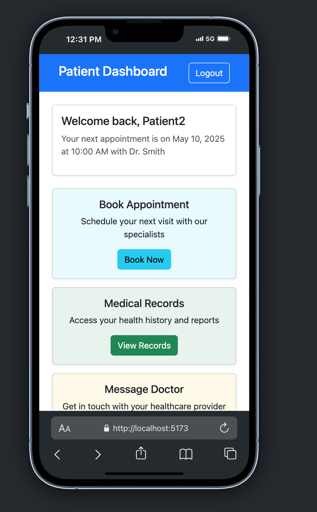
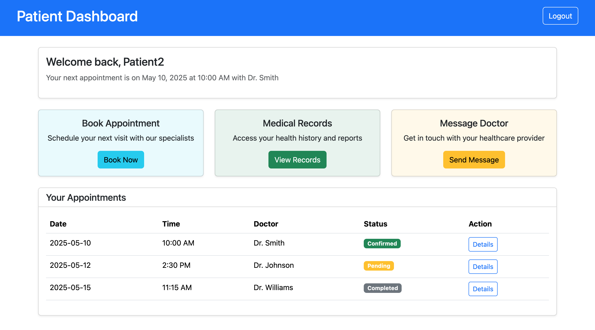
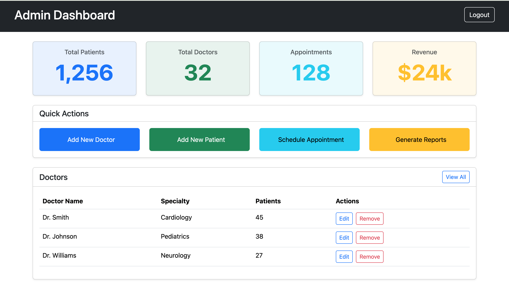
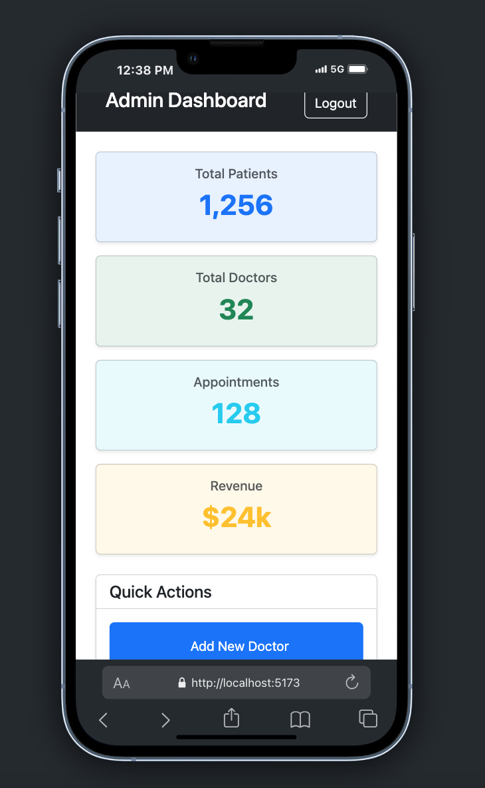
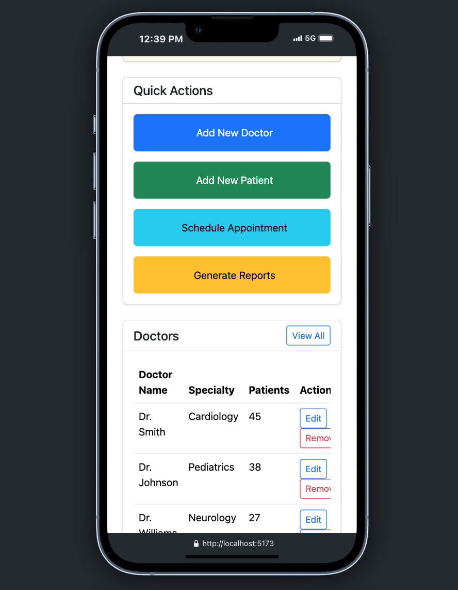
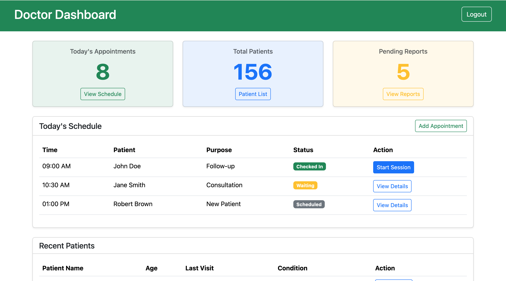
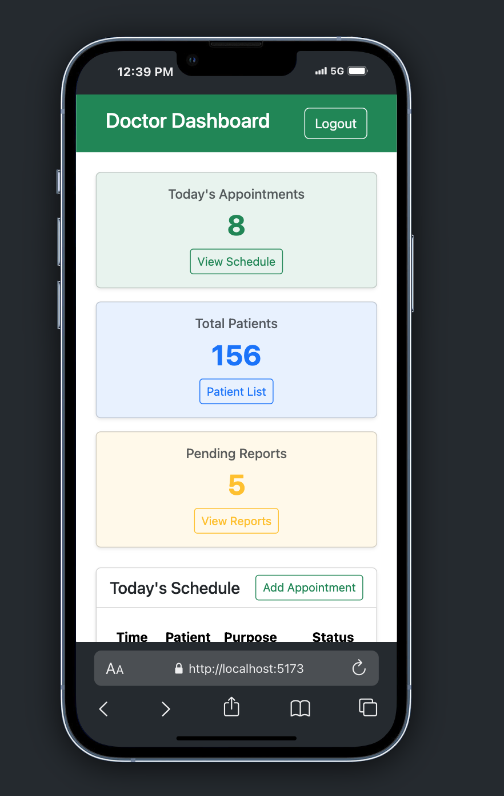

# Hospital-Management-System

This is a full-stack **Hospital Management System** built using **React**, **Redux**, **Django**, **JWT authentication**, and **Bootstrap**. It provides role-based dashboards for **Admins**, **Doctors**, and **Patients**, with features like appointment booking, user authentication, and role-specific access.

---

## 🚀 Features

- 🔐 **JWT Authentication** with role-based access (Patient, Doctor, Admin)
- 👨‍⚕️ **Doctor Dashboard**: View appointments, manage schedules
- 👩‍💼 **Admin Dashboard**: Manage users, appointments, doctors, and patients
- 🧑‍💊 **Patient Dashboard**: Book appointments, view doctor availability
- 📅 **Appointment System**: Patients can request and manage appointments
- 🌐 **Frontend**: React + Redux + Bootstrap
- 🖥️ **Backend**: Django + Django REST Framework

---

## 🛠️ Technologies Used

### Frontend:

- React
- Redux
- React Router
- Bootstrap

### Backend:

- Django
- Django REST Framework (DRF)
- JWT Authentication (using `djangorestframework-simplejwt`)

---

## 🔧 Installation

### 1. Clone the repository

```bash
git clone https://github.com/PatrickBett/hospital-management-system.git
cd hospital-management-system
# Patient dashboard on mobile and desktop view


# Admin dashboard on mobile and desktop view



# Doctor dashboard on mobile and desktop view


```

## Backend

cd backend
python -m venv env
source env/bin/activate # or env\Scripts\activate on Windows
pip install -r requirements.txt
python manage.py migrate
python manage.py runserver

## Frontend

cd frontend
npm install
npm start

## Default Roles

Admin: Full access to manage the system

Doctor: View and manage their appointments

Patient: Book and manage appointments
