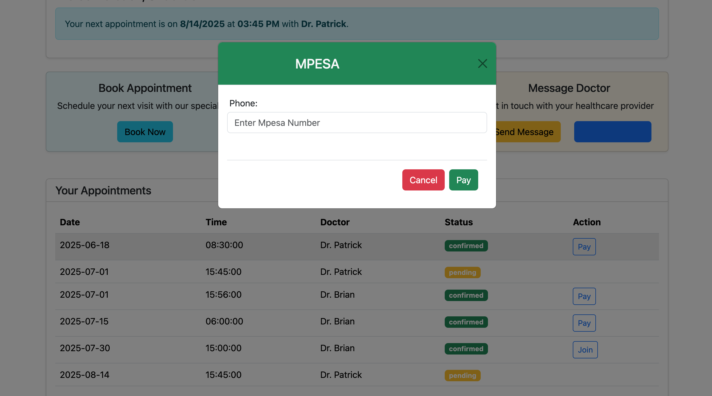

# Hospital-Management-System

This **Hospital Management System** is a comprehensive **full-stack web application developed using React, Redux, Django, JWT authentication, OAuth, and Bootstrap**. It provides tailored dashboards for different user roles—**Admins**, **Doctors**, and **Patients**—ensuring secure and role-specific access to features such as appointment booking and user management. The system also integrates **MPESA payment processing**, allowing patients to conveniently pay for their appointments. Designed to streamline hospital operations, this application offers an efficient, user-friendly platform for managing healthcare services end-to-end.

---

## 🚀 Features

- 🔐 **JWT Authentication** with role-based access (Patient, Doctor, Admin)
- 🔐 **OAuth Authentication** with role-based access (Patient, Doctor, Admin)
- 👨‍⚕️ **Doctor Dashboard**: View appointments, manage schedules
- 👩‍💼 **Admin Dashboard**: Manage users, appointments, doctors, and patients
- 🧑‍💊 **Patient Dashboard**: Book appointments, view doctor availability
- 📅 **Appointment System**: Patients can request and manage appointments
- 🌐 **Frontend**: React + Redux + Bootstrap
- 🖥️ **Backend**: Django + Django REST Framework

---

## 🛠️ Technologies Used

### Frontend:

- React
- Redux
- React Router
- Bootstrap

### Backend:

- Django
- Django REST Framework (DRF)
- JWT Authentication (using `djangorestframework-simplejwt`)
- Google OAuth authentication

---

## 🔧 Installation

### 1. Clone the repository

```bash
git clone https://github.com/PatrickBett/hospital-management-system.git
cd hospital-management-system

```

# Patient dashboard on mobile and desktop view


# Admin dashboard on mobile and desktop view


# Doctor dashboard on mobile and desktop view


# Mpesa Payment



## Backend

- python -m venv env
- cd backend
- source env/bin/activate # or env\Scripts\activate on Windows
- pip install -r requirements.txt
- python manage.py migrate
- python manage.py runserver

## Frontend

- cd frontend
- npm install
- npm start

## Default Roles

- Admin: Full access to manage the system

- Doctor: View and manage their appointments

- Patient: Book and manage appointments
